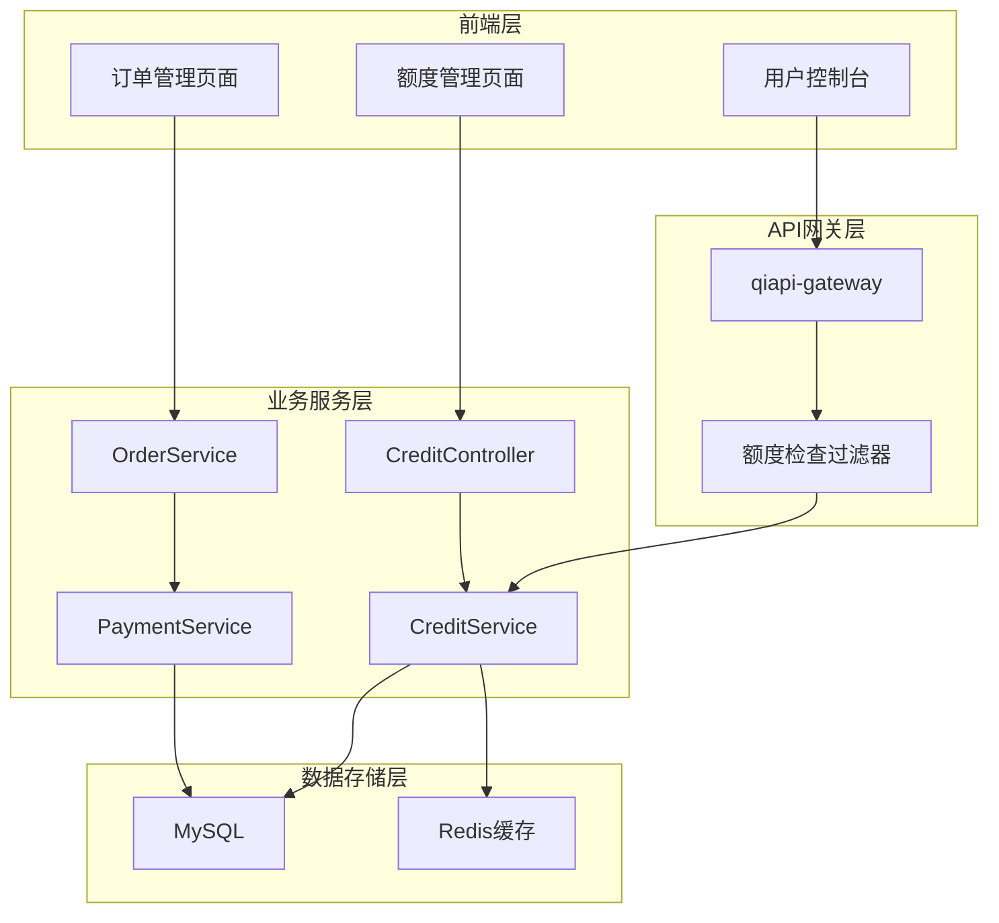
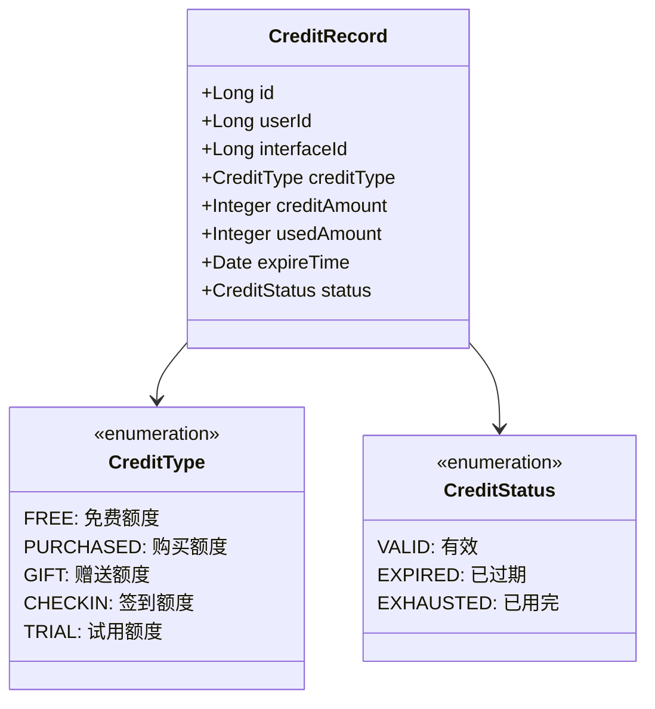
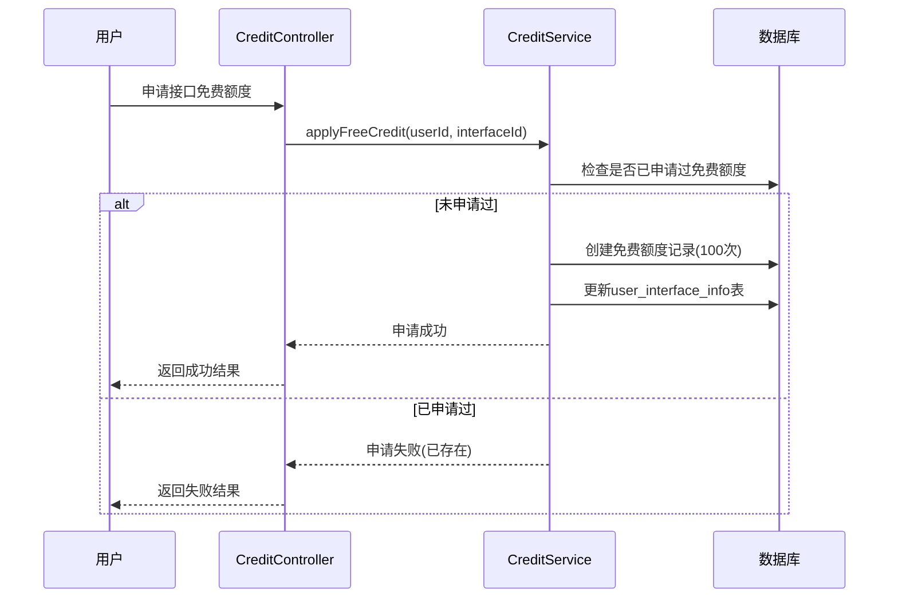
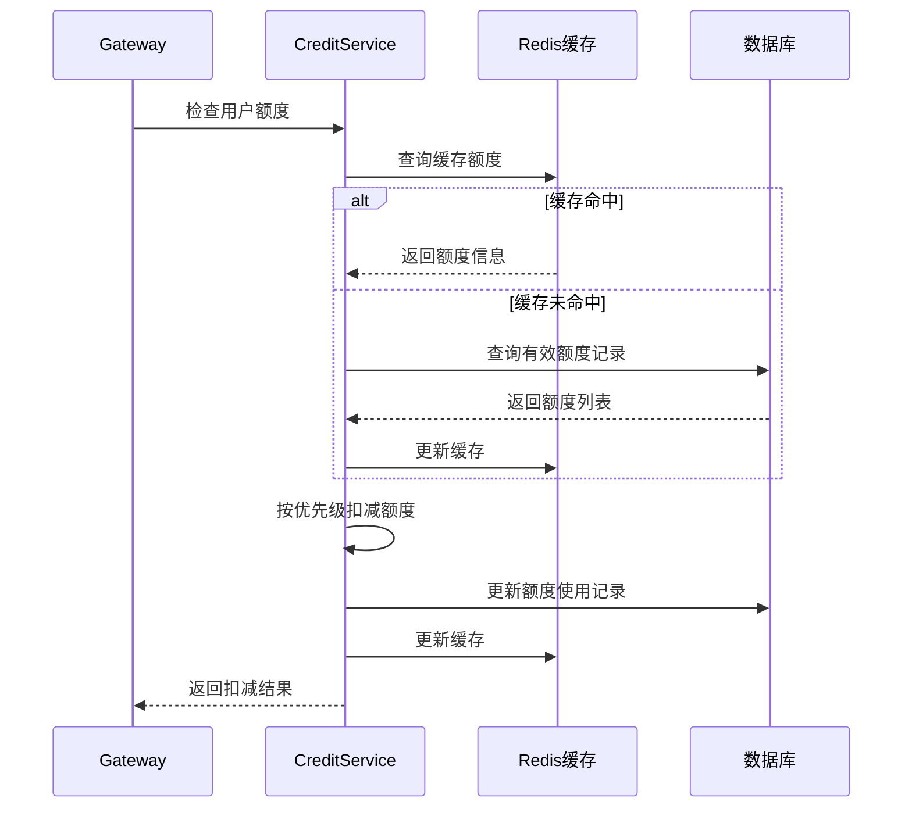
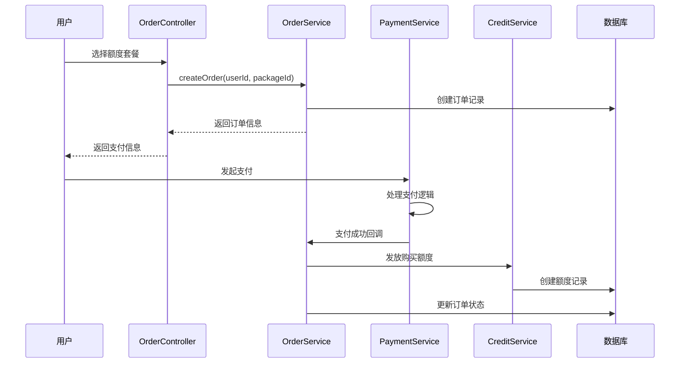
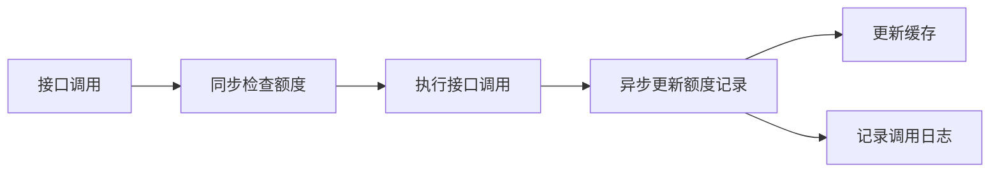
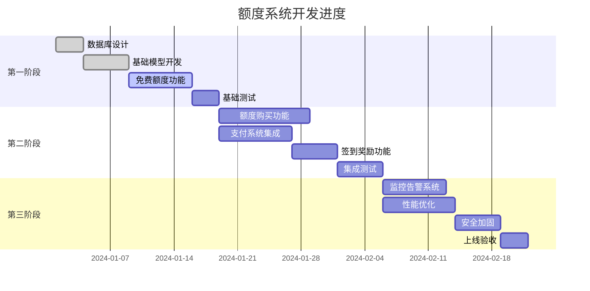

# QiAPI开放平台额度系统增强设计

## 概述

本设计文档描述了QiAPI开放平台额度系统的增强方案，旨在为用户提供灵活的接口调用额度管理机制。系统将提供基础固定额度和多样化的额度获取方式，满足不同用户群体的需求。

### 设计目标
- 为每个接口提供100次基础免费额度
- 实现多种额度获取机制
- 提供额度监控和管理功能
- 保障系统稳定性和安全性

## 技术栈与依赖

### 后端技术栈
- **框架**: Spring Boot 3.x
- **ORM**: MyBatis-Plus
- **数据库**: MySQL 8.0
- **缓存**: Redis
- **消息队列**: RabbitMQ (可选)
- **定时任务**: Spring Task Scheduler

### 前端技术栈
- **框架**: React + Ant Design Pro
- **状态管理**: useState/useModel
- **HTTP客户端**: umi-request

## 架构设计

### 系统架构图



### 数据库设计

#### 新增数据表结构

```sql
-- 额度套餐表
CREATE TABLE credit_package (
    id BIGINT AUTO_INCREMENT PRIMARY KEY COMMENT '套餐ID',
    name VARCHAR(100) NOT NULL COMMENT '套餐名称',
    credit_amount INT NOT NULL COMMENT '额度数量',
    price DECIMAL(10,2) NOT NULL COMMENT '价格(元)',
    validity_days INT NOT NULL COMMENT '有效期(天)',
    package_type TINYINT DEFAULT 1 COMMENT '套餐类型: 1-通用 2-特定接口',
    interface_id BIGINT NULL COMMENT '特定接口ID',
    status TINYINT DEFAULT 1 COMMENT '状态: 0-下架 1-上架',
    create_time DATETIME DEFAULT CURRENT_TIMESTAMP,
    update_time DATETIME DEFAULT CURRENT_TIMESTAMP ON UPDATE CURRENT_TIMESTAMP,
    is_delete TINYINT DEFAULT 0
) COMMENT '额度套餐表';

-- 用户额度记录表
CREATE TABLE user_credit_record (
    id BIGINT AUTO_INCREMENT PRIMARY KEY COMMENT '记录ID',
    user_id BIGINT NOT NULL COMMENT '用户ID',
    interface_id BIGINT NOT NULL COMMENT '接口ID',
    credit_type TINYINT NOT NULL COMMENT '额度类型: 1-免费 2-购买 3-赠送 4-签到',
    credit_amount INT NOT NULL COMMENT '额度数量',
    used_amount INT DEFAULT 0 COMMENT '已使用数量',
    expire_time DATETIME NOT NULL COMMENT '过期时间',
    source_order_id BIGINT NULL COMMENT '来源订单ID',
    status TINYINT DEFAULT 1 COMMENT '状态: 0-已过期 1-有效',
    create_time DATETIME DEFAULT CURRENT_TIMESTAMP,
    update_time DATETIME DEFAULT CURRENT_TIMESTAMP ON UPDATE CURRENT_TIMESTAMP
) COMMENT '用户额度记录表';

-- 订单表
CREATE TABLE credit_order (
    id BIGINT AUTO_INCREMENT PRIMARY KEY COMMENT '订单ID',
    order_no VARCHAR(64) UNIQUE NOT NULL COMMENT '订单号',
    user_id BIGINT NOT NULL COMMENT '用户ID',
    package_id BIGINT NOT NULL COMMENT '套餐ID',
    credit_amount INT NOT NULL COMMENT '购买额度',
    total_amount DECIMAL(10,2) NOT NULL COMMENT '订单金额',
    pay_status TINYINT DEFAULT 0 COMMENT '支付状态: 0-未支付 1-已支付 2-已退款',
    pay_method VARCHAR(20) NULL COMMENT '支付方式',
    pay_time DATETIME NULL COMMENT '支付时间',
    create_time DATETIME DEFAULT CURRENT_TIMESTAMP,
    update_time DATETIME DEFAULT CURRENT_TIMESTAMP ON UPDATE CURRENT_TIMESTAMP
) COMMENT '额度订单表';

-- 用户签到记录表
CREATE TABLE user_checkin_record (
    id BIGINT AUTO_INCREMENT PRIMARY KEY COMMENT '记录ID',
    user_id BIGINT NOT NULL COMMENT '用户ID',
    checkin_date DATE NOT NULL COMMENT '签到日期',
    consecutive_days INT DEFAULT 1 COMMENT '连续签到天数',
    reward_credit INT NOT NULL COMMENT '奖励额度',
    create_time DATETIME DEFAULT CURRENT_TIMESTAMP,
    UNIQUE KEY uk_user_date (user_id, checkin_date)
) COMMENT '用户签到记录表';
```

### 额度类型设计



## 核心业务流程

### 用户申请免费额度流程



### 接口调用额度扣减流程



### 额度购买流程



## 接口设计

### CreditController接口定义

```java
@RestController
@RequestMapping("/api/credit")
public class CreditController {
    
    /**
     * 申请接口免费额度
     */
    @PostMapping("/apply/free")
    public BaseResponse<Boolean> applyFreeCredit(@RequestParam Long interfaceId);
    
    /**
     * 查询用户额度详情
     */
    @GetMapping("/detail")
    public BaseResponse<CreditDetailVO> getCreditDetail(@RequestParam Long interfaceId);
    
    /**
     * 查询用户所有额度
     */
    @GetMapping("/list")
    public BaseResponse<List<CreditRecordVO>> getCreditList();
    
    /**
     * 获取额度套餐列表
     */
    @GetMapping("/packages")
    public BaseResponse<List<CreditPackageVO>> getCreditPackages();
    
    /**
     * 用户签到
     */
    @PostMapping("/checkin")
    public BaseResponse<CheckinResultVO> dailyCheckin();
}
```

### VO对象设计

```java
// 额度详情VO
public class CreditDetailVO {
    private Long interfaceId;
    private String interfaceName;
    private Integer totalCredit;      // 总额度
    private Integer usedCredit;       // 已使用
    private Integer remainingCredit;  // 剩余额度
    private List<CreditRecordVO> records; // 额度记录明细
}

// 额度记录VO
public class CreditRecordVO {
    private Long id;
    private Integer creditType;
    private Integer creditAmount;
    private Integer usedAmount;
    private Date expireTime;
    private Integer status;
    private Date createTime;
}

// 套餐VO
public class CreditPackageVO {
    private Long id;
    private String name;
    private Integer creditAmount;
    private BigDecimal price;
    private Integer validityDays;
    private Integer packageType;
}
```

## 核心业务逻辑

### 额度分配策略

#### 免费额度机制
- 每个接口首次申请可获得100次免费调用额度
- 免费额度有效期为1年
- 每个用户每个接口只能申请一次免费额度

#### 额度使用优先级
1. **临近过期额度** - 优先使用即将过期的额度
2. **免费额度** - 其次使用免费额度
3. **购买额度** - 最后使用付费购买的额度

### 缓存策略

```java
// Redis缓存Key设计
public class CreditCacheKeys {
    public static final String USER_CREDIT_KEY = "credit:user:%d:interface:%d";
    public static final String USER_TOTAL_CREDIT_KEY = "credit:user:%d:total";
    public static final String INTERFACE_CREDIT_CONFIG = "credit:interface:%d:config";
    
    // 缓存过期时间
    public static final int CACHE_EXPIRE_SECONDS = 300; // 5分钟
}
```

### 异步处理机制



## 数据模型设计

### 额度扣减算法

```java
public class CreditDeductionService {
    
    /**
     * 按优先级扣减用户额度
     */
    public boolean deductCredit(Long userId, Long interfaceId, Integer amount) {
        // 1. 查询用户有效额度记录，按过期时间升序
        List<UserCreditRecord> creditRecords = getCreditRecords(userId, interfaceId);
        
        int remainingAmount = amount;
        List<UserCreditRecord> updateRecords = new ArrayList<>();
        
        // 2. 按优先级扣减额度
        for (UserCreditRecord record : creditRecords) {
            if (remainingAmount <= 0) break;
            
            int availableCredit = record.getCreditAmount() - record.getUsedAmount();
            if (availableCredit <= 0) continue;
            
            int deductAmount = Math.min(remainingAmount, availableCredit);
            record.setUsedAmount(record.getUsedAmount() + deductAmount);
            remainingAmount -= deductAmount;
            
            updateRecords.add(record);
        }
        
        // 3. 检查是否扣减成功
        if (remainingAmount > 0) {
            return false; // 额度不足
        }
        
        // 4. 批量更新数据库
        batchUpdateCreditRecords(updateRecords);
        
        // 5. 更新缓存
        updateCreditCache(userId, interfaceId);
        
        return true;
    }
}
```

### 签到奖励机制

```java
public class CheckinRewardService {
    
    // 签到奖励配置
    private static final Map<Integer, Integer> CHECKIN_REWARDS = Map.of(
        1, 5,    // 第1天: 5次额度
        3, 10,   // 连续3天: 10次额度
        7, 20,   // 连续7天: 20次额度
        15, 50,  // 连续15天: 50次额度
        30, 100  // 连续30天: 100次额度
    );
    
    public CheckinResultVO dailyCheckin(Long userId) {
        // 检查今日是否已签到
        if (isCheckinToday(userId)) {
            throw new BusinessException("今日已签到");
        }
        
        // 计算连续签到天数
        int consecutiveDays = calculateConsecutiveDays(userId);
        
        // 计算奖励额度
        int rewardCredit = calculateReward(consecutiveDays);
        
        // 记录签到
        recordCheckin(userId, consecutiveDays, rewardCredit);
        
        // 发放通用额度奖励
        grantUniversalCredit(userId, rewardCredit);
        
        return new CheckinResultVO(consecutiveDays, rewardCredit);
    }
}
```

## 前端组件设计

### 额度管理页面组件

```typescript
// 额度管理主页面
const CreditManagement: React.FC = () => {
  const [creditList, setCreditList] = useState<CreditDetailVO[]>([]);
  const [loading, setLoading] = useState(false);
  
  // 获取用户额度列表
  const fetchCreditList = async () => {
    setLoading(true);
    try {
      const response = await getCreditList();
      setCreditList(response.data || []);
    } catch (error) {
      message.error('获取额度信息失败');
    } finally {
      setLoading(false);
    }
  };
  
  // 申请免费额度
  const handleApplyFreeCredit = async (interfaceId: number) => {
    try {
      await applyFreeCredit(interfaceId);
      message.success('申请成功');
      fetchCreditList();
    } catch (error) {
      message.error('申请失败');
    }
  };
  
  return (
    <PageContainer title="额度管理">
      <ProTable<CreditDetailVO>
        dataSource={creditList}
        loading={loading}
        columns={[
          {
            title: '接口名称',
            dataIndex: 'interfaceName',
          },
          {
            title: '总额度',
            dataIndex: 'totalCredit',
          },
          {
            title: '剩余额度',
            dataIndex: 'remainingCredit',
            render: (value, record) => (
              <span style={{ color: value < 10 ? '#ff4d4f' : '#52c41a' }}>
                {value}
              </span>
            ),
          },
          {
            title: '操作',
            render: (_, record) => (
              <Space>
                <Button 
                  type="primary" 
                  size="small"
                  onClick={() => handleApplyFreeCredit(record.interfaceId)}
                  disabled={record.totalCredit > 0}
                >
                  申请免费额度
                </Button>
                <Button size="small">购买额度</Button>
              </Space>
            ),
          },
        ]}
      />
    </PageContainer>
  );
};
```

## 单元测试策略

### CreditService测试用例

```java
@SpringBootTest
public class CreditServiceTest {
    
    @Autowired
    private CreditService creditService;
    
    @Test
    public void testApplyFreeCredit_Success() {
        // 测试首次申请免费额度成功
        Long userId = 1L;
        Long interfaceId = 1L;
        
        boolean result = creditService.applyFreeCredit(userId, interfaceId);
        
        assertTrue(result);
        
        // 验证数据库记录
        UserCreditRecord record = creditService.getCreditRecord(userId, interfaceId, CreditType.FREE);
        assertNotNull(record);
        assertEquals(100, record.getCreditAmount());
    }
    
    @Test
    public void testApplyFreeCredit_AlreadyExists() {
        // 测试重复申请免费额度失败
        Long userId = 1L;
        Long interfaceId = 1L;
        
        // 第一次申请
        creditService.applyFreeCredit(userId, interfaceId);
        
        // 第二次申请应该失败
        assertThrows(BusinessException.class, () -> {
            creditService.applyFreeCredit(userId, interfaceId);
        });
    }
    
    @Test
    public void testDeductCredit_Success() {
        // 测试额度扣减成功
        Long userId = 1L;
        Long interfaceId = 1L;
        
        // 先申请免费额度
        creditService.applyFreeCredit(userId, interfaceId);
        
        // 扣减5次额度
        boolean result = creditService.deductCredit(userId, interfaceId, 5);
        
        assertTrue(result);
        
        // 验证剩余额度
        int remainingCredit = creditService.getRemainingCredit(userId, interfaceId);
        assertEquals(95, remainingCredit);
    }
    
    @Test
    public void testDeductCredit_InsufficientCredit() {
        // 测试额度不足扣减失败
        Long userId = 1L;
        Long interfaceId = 1L;
        
        boolean result = creditService.deductCredit(userId, interfaceId, 10);
        
        assertFalse(result);
    }
}
```

## 监控与告警

### 额度监控指标

```java
@Component
public class CreditMetrics {
    
    private final MeterRegistry meterRegistry;
    
    // 额度使用量统计
    public void recordCreditUsage(Long interfaceId, Integer amount) {
        Counter.builder("credit.usage")
            .tag("interface_id", String.valueOf(interfaceId))
            .register(meterRegistry)
            .increment(amount);
    }
    
    // 额度不足告警
    public void recordInsufficientCredit(Long userId, Long interfaceId) {
        Counter.builder("credit.insufficient")
            .tag("user_id", String.valueOf(userId))
            .tag("interface_id", String.valueOf(interfaceId))
            .register(meterRegistry)
            .increment();
    }
    
    // 免费额度申请统计
    public void recordFreeCreditApplication(Long interfaceId, boolean success) {
        Counter.builder("credit.free.application")
            .tag("interface_id", String.valueOf(interfaceId))
            .tag("status", success ? "success" : "failed")
            .register(meterRegistry)
            .increment();
    }
}
```

### 告警规则配置

```yaml
# Prometheus告警规则
groups:
  - name: credit_alerts
    rules:
      - alert: HighCreditUsage
        expr: rate(credit_usage_total[5m]) > 1000
        for: 2m
        labels:
          severity: warning
        annotations:
          summary: "接口额度使用率过高"
          description: "接口 {{ $labels.interface_id }} 在过去5分钟内额度使用量超过1000次"
      
      - alert: FreeCreditExhausted
        expr: credit_insufficient_total > 10
        for: 1m
        labels:
          severity: critical
        annotations:
          summary: "用户免费额度耗尽"
          description: "用户 {{ $labels.user_id }} 的接口额度不足，影响正常使用"
```

## 性能优化

### 缓存优化策略

```java
@Service
public class CreditCacheService {
    
    @Autowired
    private RedisTemplate<String, Object> redisTemplate;
    
    // 批量预加载用户常用接口额度
    @Async
    public void preloadUserCredit(Long userId, List<Long> interfaceIds) {
        interfaceIds.parallelStream().forEach(interfaceId -> {
            String cacheKey = String.format(CreditCacheKeys.USER_CREDIT_KEY, userId, interfaceId);
            if (!redisTemplate.hasKey(cacheKey)) {
                CreditDetailVO creditDetail = creditService.getCreditDetail(userId, interfaceId);
                redisTemplate.opsForValue().set(cacheKey, creditDetail, 
                    CreditCacheKeys.CACHE_EXPIRE_SECONDS, TimeUnit.SECONDS);
            }
        });
    }
    
    // 布隆过滤器防止缓存穿透
    @PostConstruct
    public void initBloomFilter() {
        // 初始化布隆过滤器，预加载所有有效的用户-接口组合
        List<UserInterfaceInfo> allUserInterfaces = userInterfaceInfoService.list();
        allUserInterfaces.forEach(ui -> {
            String key = ui.getUserId() + ":" + ui.getInterfaceInfoId();
            bloomFilter.put(key);
        });
    }
}
```

### 数据库优化

```sql
-- 添加复合索引优化查询性能
ALTER TABLE user_credit_record ADD INDEX idx_user_interface_expire (user_id, interface_id, expire_time);
ALTER TABLE user_credit_record ADD INDEX idx_user_interface_status (user_id, interface_id, status);
ALTER TABLE user_interface_info ADD INDEX idx_user_interface_unique (userId, interfaceInfoId);
ALTER TABLE credit_order ADD INDEX idx_user_paystatus (user_id, pay_status);
ALTER TABLE user_checkin_record ADD INDEX idx_user_date (user_id, checkin_date);

-- 分区策略（按月分区）
ALTER TABLE user_credit_record 
PARTITION BY RANGE (YEAR(create_time)*100 + MONTH(create_time)) (
    PARTITION p202401 VALUES LESS THAN (202402),
    PARTITION p202402 VALUES LESS THAN (202403),
    PARTITION p202403 VALUES LESS THAN (202404),
    PARTITION p_future VALUES LESS THAN MAXVALUE
);
```

## 安全设计

### 防刷机制

```java
@Component
public class CreditSecurityService {
    
    @Autowired
    private RedisTemplate<String, Object> redisTemplate;
    
    // 申请免费额度限流
    public boolean checkFreeCreditRateLimit(Long userId) {
        String key = "rate_limit:free_credit:" + userId;
        String script = 
            "local current = redis.call('incr', KEYS[1]) " +
            "if current == 1 then " +
            "    redis.call('expire', KEYS[1], ARGV[1]) " +
            "end " +
            "return current";
        
        Long count = (Long) redisTemplate.execute(
            new DefaultRedisScript<>(script, Long.class),
            Arrays.asList(key),
            "3600" // 1小时内最多申请5次
        );
        
        return count <= 5;
    }
    
    // 异常调用检测
    public boolean detectAbnormalUsage(Long userId, Long interfaceId, Integer amount) {
        String key = "usage_pattern:" + userId + ":" + interfaceId;
        
        // 记录最近1小时的调用模式
        redisTemplate.opsForList().leftPush(key, amount + ":" + System.currentTimeMillis());
        redisTemplate.expire(key, 3600, TimeUnit.SECONDS);
        
        // 分析调用模式，检测异常
        List<Object> usageList = redisTemplate.opsForList().range(key, 0, 99);
        return analyzeUsagePattern(usageList);
    }
    
    private boolean analyzeUsagePattern(List<Object> usageList) {
        // 实现异常检测逻辑
        // 例如：短时间内大量调用、调用频率异常等
        return true;
    }
}
```

### 数据加密

```java
@Component
public class CreditDataSecurity {
    
    @Value("${credit.encryption.key}")
    private String encryptionKey;
    
    // 敏感数据加密存储
    public String encryptCreditData(String data) {
        try {
            Cipher cipher = Cipher.getInstance("AES/CBC/PKCS5Padding");
            SecretKeySpec keySpec = new SecretKeySpec(encryptionKey.getBytes(), "AES");
            cipher.init(Cipher.ENCRYPT_MODE, keySpec);
            byte[] encrypted = cipher.doFinal(data.getBytes());
            return Base64.getEncoder().encodeToString(encrypted);
        } catch (Exception e) {
            throw new BusinessException("数据加密失败");
        }
    }
    
    // 数据解密
    public String decryptCreditData(String encryptedData) {
        try {
            Cipher cipher = Cipher.getInstance("AES/CBC/PKCS5Padding");
            SecretKeySpec keySpec = new SecretKeySpec(encryptionKey.getBytes(), "AES");
            cipher.init(Cipher.DECRYPT_MODE, keySpec);
            byte[] decrypted = cipher.doFinal(Base64.getDecoder().decode(encryptedData));
            return new String(decrypted);
        } catch (Exception e) {
            throw new BusinessException("数据解密失败");
        }
    }
}
```

## 配置管理

### 应用配置

```yaml
# application.yml
spring:
  redis:
    host: localhost
    port: 6379
    database: 0
    timeout: 3000ms
    jedis:
      pool:
        max-active: 20
        max-idle: 10
        min-idle: 5
  
  datasource:
    url: jdbc:mysql://localhost:3306/qiapi?useUnicode=true&characterEncoding=utf8&useSSL=false
    username: ${DB_USERNAME:root}
    password: ${DB_PASSWORD:123456}
    driver-class-name: com.mysql.cj.jdbc.Driver
    
  rabbitmq:
    host: localhost
    port: 5672
    username: guest
    password: guest
    virtual-host: /

# 额度系统配置
credit:
  # 免费额度配置
  free:
    default-amount: 100
    validity-days: 365
    
  # 缓存配置
  cache:
    expire-seconds: 300
    preload-enabled: true
    
  # 安全配置
  security:
    rate-limit:
      free-application: 5  # 每小时最多申请5次免费额度
      usage-check: 1000    # 每小时最多使用1000次额度
    encryption:
      enabled: true
      algorithm: AES
      
  # 签到奖励配置
  checkin:
    enabled: true
    rewards:
      day1: 5
      day3: 10
      day7: 20
      day15: 50
      day30: 100
      
  # 监控配置
  monitoring:
    metrics-enabled: true
    alert-threshold:
      usage-rate: 1000
      insufficient-count: 10
```

### 业务规则配置

```java
@ConfigurationProperties(prefix = "credit")
@Data
public class CreditProperties {
    
    private Free free = new Free();
    private Cache cache = new Cache();
    private Security security = new Security();
    private Checkin checkin = new Checkin();
    private Monitoring monitoring = new Monitoring();
    
    @Data
    public static class Free {
        private Integer defaultAmount = 100;
        private Integer validityDays = 365;
    }
    
    @Data
    public static class Cache {
        private Integer expireSeconds = 300;
        private Boolean preloadEnabled = true;
    }
    
    @Data
    public static class Security {
        private RateLimit rateLimit = new RateLimit();
        private Encryption encryption = new Encryption();
        
        @Data
        public static class RateLimit {
            private Integer freeApplication = 5;
            private Integer usageCheck = 1000;
        }
        
        @Data
        public static class Encryption {
            private Boolean enabled = true;
            private String algorithm = "AES";
        }
    }
    
    @Data
    public static class Checkin {
        private Boolean enabled = true;
        private Map<String, Integer> rewards = new HashMap<>();
    }
    
    @Data
    public static class Monitoring {
        private Boolean metricsEnabled = true;
        private AlertThreshold alertThreshold = new AlertThreshold();
        
        @Data
        public static class AlertThreshold {
            private Integer usageRate = 1000;
            private Integer insufficientCount = 10;
        }
    }
}
```

## 异常处理

### 异常定义

```java
public enum CreditErrorCode {
    
    CREDIT_INSUFFICIENT(40001, "额度不足"),
    FREE_CREDIT_ALREADY_APPLIED(40002, "免费额度已申请过"),
    CREDIT_EXPIRED(40003, "额度已过期"),
    INVALID_CREDIT_PACKAGE(40004, "无效的额度套餐"),
    PAYMENT_FAILED(40005, "支付失败"),
    CHECKIN_ALREADY_TODAY(40006, "今日已签到"),
    RATE_LIMIT_EXCEEDED(40007, "操作过于频繁"),
    CREDIT_OPERATION_FAILED(50001, "额度操作失败");
    
    private final int code;
    private final String message;
    
    CreditErrorCode(int code, String message) {
        this.code = code;
        this.message = message;
    }
    
    // getters...
}

@ControllerAdvice
public class CreditExceptionHandler {
    
    @ExceptionHandler(CreditInsufficientException.class)
    public BaseResponse<Object> handleCreditInsufficientException(CreditInsufficientException e) {
        return ResultUtils.error(CreditErrorCode.CREDIT_INSUFFICIENT.getCode(), 
                               CreditErrorCode.CREDIT_INSUFFICIENT.getMessage());
    }
    
    @ExceptionHandler(FreeCreditAlreadyAppliedException.class)
    public BaseResponse<Object> handleFreeCreditAlreadyAppliedException(FreeCreditAlreadyAppliedException e) {
        return ResultUtils.error(CreditErrorCode.FREE_CREDIT_ALREADY_APPLIED.getCode(), 
                               CreditErrorCode.FREE_CREDIT_ALREADY_APPLIED.getMessage());
    }
    
    // 其他异常处理...
}
```

## 部署指南

### Docker部署配置

```dockerfile
# Dockerfile for Credit Service
FROM openjdk:11-jre-slim

VOLUME /tmp
ADD target/qiapi-backend.jar app.jar

# 添加时区和语言环境
RUN ln -sf /usr/share/zoneinfo/Asia/Shanghai /etc/localtime
RUN echo 'Asia/Shanghai' > /etc/timezone

# JVM优化参数
ENV JAVA_OPTS="-Xms512m -Xmx1024m -XX:+UseG1GC -XX:+HeapDumpOnOutOfMemoryError"

EXPOSE 8080

ENTRYPOINT ["java", "-jar", "/app.jar"]
```

```yaml
# docker-compose.yml
version: '3.8'
services:
  qiapi-backend:
    build: .
    ports:
      - "8080:8080"
    environment:
      - SPRING_PROFILES_ACTIVE=prod
      - DB_HOST=mysql
      - REDIS_HOST=redis
      - RABBITMQ_HOST=rabbitmq
    depends_on:
      - mysql
      - redis
      - rabbitmq
    volumes:
      - ./logs:/app/logs
      
  mysql:
    image: mysql:8.0
    environment:
      MYSQL_ROOT_PASSWORD: root123
      MYSQL_DATABASE: qiapi
    volumes:
      - mysql_data:/var/lib/mysql
      - ./sql:/docker-entrypoint-initdb.d
    ports:
      - "3306:3306"
      
  redis:
    image: redis:6.2-alpine
    ports:
      - "6379:6379"
    volumes:
      - redis_data:/data
      
  rabbitmq:
    image: rabbitmq:3.9-management
    environment:
      RABBITMQ_DEFAULT_USER: admin
      RABBITMQ_DEFAULT_PASS: admin123
    ports:
      - "5672:5672"
      - "15672:15672"
    volumes:
      - rabbitmq_data:/var/lib/rabbitmq
      
volumes:
  mysql_data:
  redis_data:
  rabbitmq_data:
```

### Kubernetes部署

```yaml
# credit-service-deployment.yaml
apiVersion: apps/v1
kind: Deployment
metadata:
  name: credit-service
  labels:
    app: credit-service
spec:
  replicas: 3
  selector:
    matchLabels:
      app: credit-service
  template:
    metadata:
      labels:
        app: credit-service
    spec:
      containers:
      - name: credit-service
        image: qiapi/credit-service:latest
        ports:
        - containerPort: 8080
        env:
        - name: SPRING_PROFILES_ACTIVE
          value: "k8s"
        - name: DB_HOST
          value: "mysql-service"
        - name: REDIS_HOST
          value: "redis-service"
        resources:
          requests:
            memory: "512Mi"
            cpu: "250m"
          limits:
            memory: "1Gi"
            cpu: "500m"
        livenessProbe:
          httpGet:
            path: /actuator/health
            port: 8080
          initialDelaySeconds: 30
          periodSeconds: 10
        readinessProbe:
          httpGet:
            path: /actuator/health
            port: 8080
          initialDelaySeconds: 5
          periodSeconds: 5
---
apiVersion: v1
kind: Service
metadata:
  name: credit-service
spec:
  selector:
    app: credit-service
  ports:
  - protocol: TCP
    port: 80
    targetPort: 8080
  type: ClusterIP
```

### 数据库迁移脚本

```sql
-- V1.0__Create_credit_tables.sql
-- 创建额度系统相关表

-- 额度套餐表
CREATE TABLE credit_package (
    id BIGINT AUTO_INCREMENT PRIMARY KEY COMMENT '套餐ID',
    name VARCHAR(100) NOT NULL COMMENT '套餐名称',
    credit_amount INT NOT NULL COMMENT '额度数量',
    price DECIMAL(10,2) NOT NULL COMMENT '价格(元)',
    validity_days INT NOT NULL COMMENT '有效期(天)',
    package_type TINYINT DEFAULT 1 COMMENT '套餐类型: 1-通用 2-特定接口',
    interface_id BIGINT NULL COMMENT '特定接口ID',
    status TINYINT DEFAULT 1 COMMENT '状态: 0-下架 1-上架',
    create_time DATETIME DEFAULT CURRENT_TIMESTAMP,
    update_time DATETIME DEFAULT CURRENT_TIMESTAMP ON UPDATE CURRENT_TIMESTAMP,
    is_delete TINYINT DEFAULT 0
) COMMENT '额度套餐表';

-- 初始化套餐数据
INSERT INTO credit_package (name, credit_amount, price, validity_days, package_type) VALUES
('基础包', 500, 9.90, 30, 1),
('标准包', 2000, 29.90, 30, 1),
('高级包', 10000, 99.90, 30, 1),
('专业包', 50000, 399.90, 30, 1);

-- V1.1__Add_indexes.sql
-- 添加索引优化性能
ALTER TABLE user_credit_record ADD INDEX idx_user_interface_expire (user_id, interface_id, expire_time);
ALTER TABLE user_credit_record ADD INDEX idx_user_interface_status (user_id, interface_id, status);
ALTER TABLE credit_order ADD INDEX idx_user_paystatus (user_id, pay_status);
ALTER TABLE user_checkin_record ADD INDEX idx_user_date (user_id, checkin_date);
```

## 风险评估与对策

### 技术风险

| 风险项 | 风险等级 | 影响范围 | 缓解策略 |
|---------|----------|----------|----------|
| Redis缓存失效 | 中 | 性能下降 | 提供数据库降级方案，增加缓存超时重试 |
| 数据库连接池耗尽 | 高 | 系统不可用 | 连接池监控、读写分离、分库分表 |
| 并发额度扣减冲突 | 中 | 数据不一致 | 使用分布式锁、乐观锁机制 |
| 消息队列堆积 | 中 | 异步处理延迟 | 增加消费者数量、消息持久化 |
| 签名验证绕过 | 高 | 安全问题 | 强化签名验证、IP白名单、请求限流 |

### 业务风险

| 风险项 | 风险等级 | 影响范围 | 缓解策略 |
|---------|----------|----------|----------|
| 恶意刷取免费额度 | 中 | 成本增加 | 手机验证、实名认证、风控系统 |
| 支付系统故障 | 高 | 订单失败 | 多支付渠道、支付重试、手动处理 |
| 用户投诉额度问题 | 中 | 用户满意度 | 完善客服系统、额度补偿机制 |
| 竞争对手价格战 | 低 | 盈利能力 | 差异化定价、价值提升 |

### 风险监控与响应

```java
@Component
public class CreditRiskMonitor {
    
    // 异常交易监控
    @EventListener
    public void onAbnormalTransaction(CreditTransactionEvent event) {
        if (isAbnormalTransaction(event)) {
            // 发送告警通知
            alertService.sendAlert("检测到异常额度交易: " + event.toString());
            
            // 自动冻结用户账户
            if (event.getRiskLevel() >= RiskLevel.HIGH) {
                userService.freezeUser(event.getUserId(), "异常交易自动冻结");
            }
        }
    }
    
    // 系统性能监控
    @Scheduled(fixedRate = 60000) // 每分钟检查
    public void monitorSystemPerformance() {
        SystemMetrics metrics = systemMetricsService.getCurrentMetrics();
        
        if (metrics.getCpuUsage() > 80 || metrics.getMemoryUsage() > 85) {
            alertService.sendAlert("系统资源使用率过高");
        }
        
        if (metrics.getDatabaseConnectionCount() > 80) {
            alertService.sendAlert("数据库连接池使用率过高");
        }
    }
}
```

## 项目进度计划

### 开发阶段划分



### 交付物清单

- [ ] 数据库设计文档
- [ ] API接口文档
- [ ] 前端组件库
- [ ] 后端服务代码
- [ ] 单元测试用例
- [ ] 集成测试用例
- [ ] 部署脚本
- [ ] 监控配置
- [ ] 用户手册
- [ ] 运维手册

## 总结

本设计文档全面描述了QiAPI开放平台额度系统的增强方案。通过引入多层次的额度管理机制，为用户提供了灵活的接口调用服务。

### 核心价值

1. **用户友好**: 提供100次免费额度，降低使用门槛
2. **灵活付费**: 多种套餐选择，满足不同用户需求
3. **激励机制**: 签到奖励增加用户粘性
4. **安全可靠**: 完善的安全防护和监控机制
5. **扩展性强**: 支持大并发和水平扩展

### 技术亮点

- 基于Redis的高性能缓存机制
- 智能的额度扣减算法
- 完善的异常处理和监控告警
- 微服务架构设计，支持独立部署
- 丰富的单元测试和集成测试用例

该系统的实施将显著提升QiAPI平台的用户体验和商业价值，为平台的长期发展奠定坚实基础。
```
```
