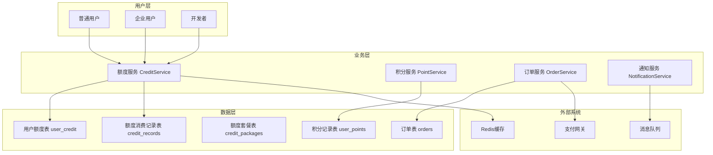
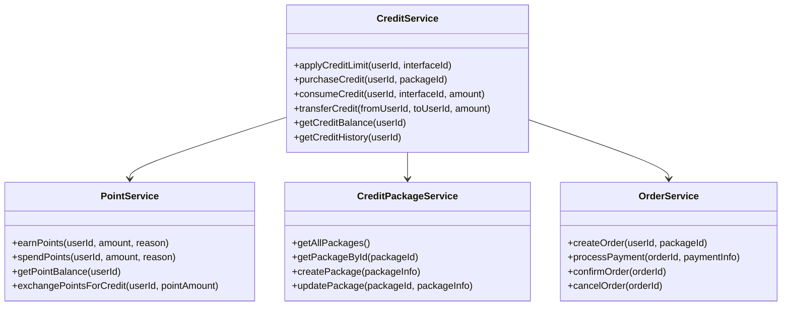
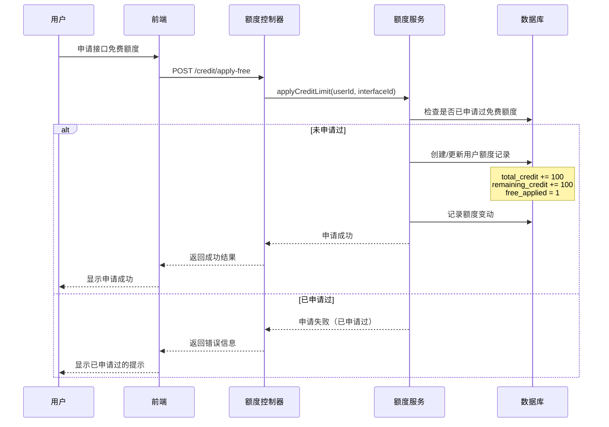
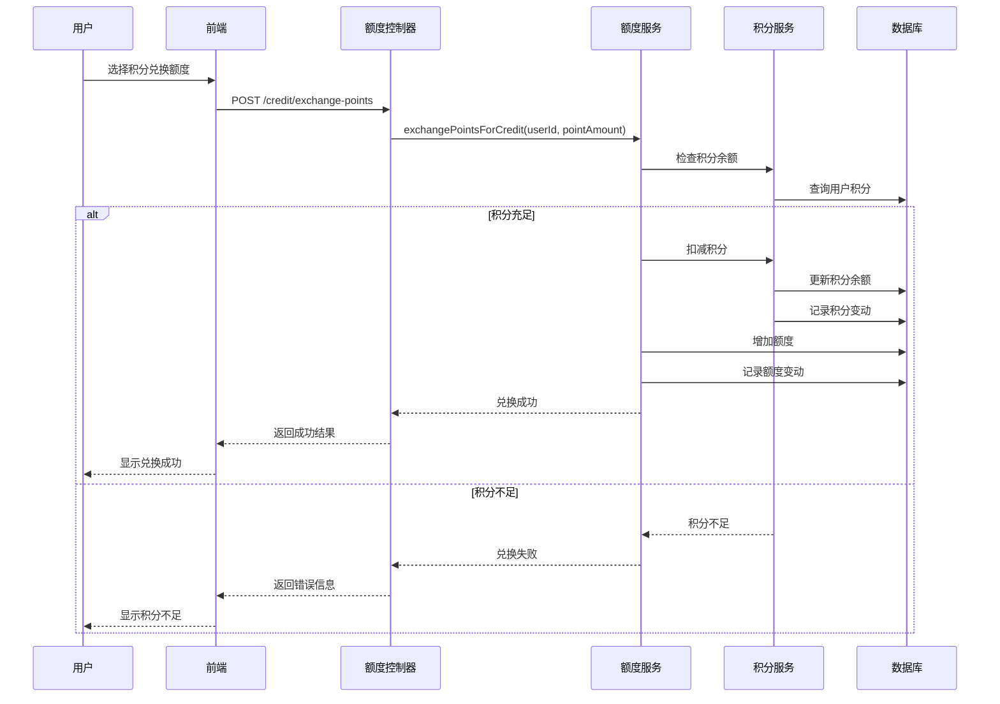
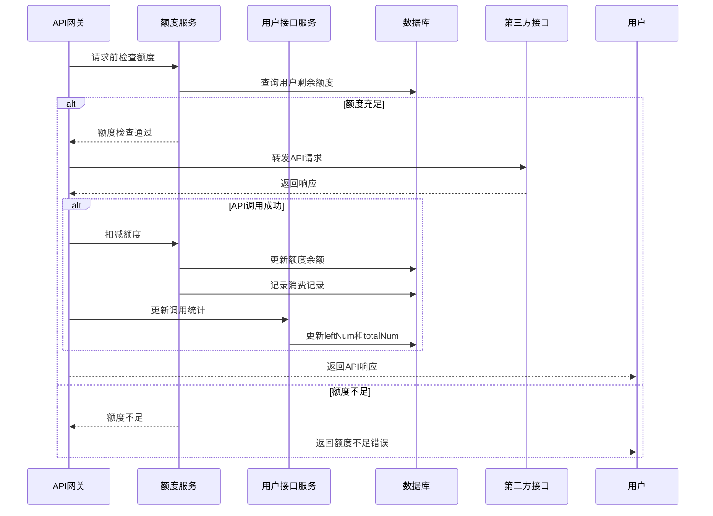
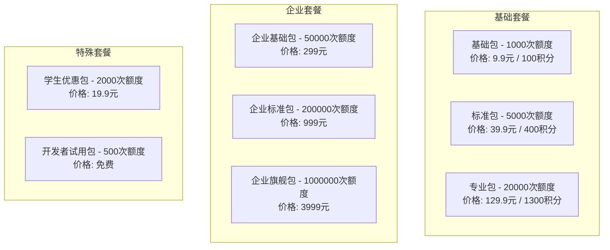
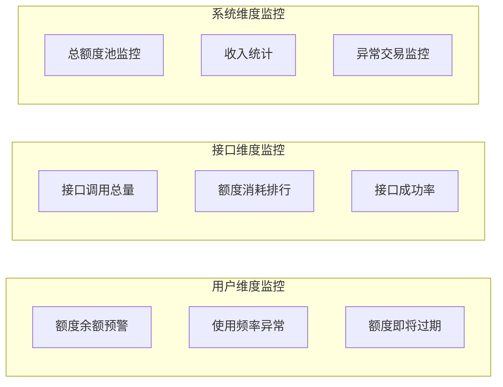
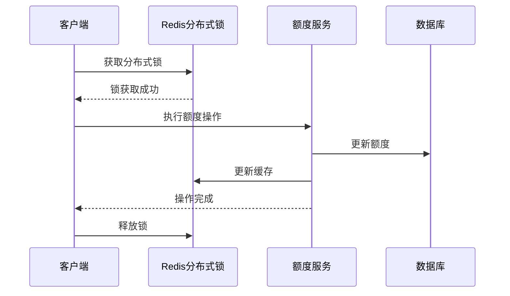

# QiAPI开放平台额度系统设计文档

## 1. 概述

本文档描述了QiAPI开放平台额度系统的完整设计方案，该系统将为用户提供灵活的API调用额度管理机制，支持固定额度申请、动态额度分配、消费记录跟踪等功能。

### 1.1 业务目标
- 为每个接口提供100次固定免费额度申请
- 实现基于积分/余额的额度购买机制
- 提供多种额度套餐和灵活的充值方案
- 建立完整的额度消费记录和统计体系
- 支持企业级用户的批量额度管理

### 1.2 核心特性
- **固定额度**: 每个接口可申请100次免费调用额度
- **积分体系**: 基于积分的额度购买和兑换机制
- **套餐管理**: 多层次的额度套餐设计
- **实时监控**: 额度消费的实时统计和告警
- **额度转移**: 支持用户间额度转移功能

## 2. 系统架构

### 2.1 整体架构设计



### 2.2 核心组件关系



## 3. 数据模型设计

### 3.1 用户额度表 (user_credit)

```sql
CREATE TABLE user_credit (
    id BIGINT PRIMARY KEY AUTO_INCREMENT COMMENT '主键ID',
    user_id BIGINT NOT NULL COMMENT '用户ID',
    interface_id BIGINT NOT NULL COMMENT '接口ID',
    total_credit BIGINT DEFAULT 0 COMMENT '总额度',
    used_credit BIGINT DEFAULT 0 COMMENT '已使用额度',
    remaining_credit BIGINT DEFAULT 0 COMMENT '剩余额度',
    free_applied TINYINT DEFAULT 0 COMMENT '是否已申请免费额度 0-未申请 1-已申请',
    status TINYINT DEFAULT 1 COMMENT '状态 0-禁用 1-正常',
    expire_time DATETIME COMMENT '额度过期时间',
    create_time DATETIME DEFAULT CURRENT_TIMESTAMP COMMENT '创建时间',
    update_time DATETIME DEFAULT CURRENT_TIMESTAMP ON UPDATE CURRENT_TIMESTAMP COMMENT '更新时间',
    is_delete TINYINT DEFAULT 0 COMMENT '是否删除 0-未删除 1-已删除',
    UNIQUE KEY uk_user_interface (user_id, interface_id),
    INDEX idx_user_id (user_id),
    INDEX idx_interface_id (interface_id)
) COMMENT '用户接口额度表';
```

### 3.2 用户积分表 (user_points)

```sql
CREATE TABLE user_points (
    id BIGINT PRIMARY KEY AUTO_INCREMENT COMMENT '主键ID',
    user_id BIGINT NOT NULL COMMENT '用户ID',
    total_points BIGINT DEFAULT 0 COMMENT '总积分',
    available_points BIGINT DEFAULT 0 COMMENT '可用积分',
    frozen_points BIGINT DEFAULT 0 COMMENT '冻结积分',
    create_time DATETIME DEFAULT CURRENT_TIMESTAMP COMMENT '创建时间',
    update_time DATETIME DEFAULT CURRENT_TIMESTAMP ON UPDATE CURRENT_TIMESTAMP COMMENT '更新时间',
    is_delete TINYINT DEFAULT 0 COMMENT '是否删除',
    UNIQUE KEY uk_user_id (user_id)
) COMMENT '用户积分表';
```

### 3.3 积分记录表 (point_records)

```sql
CREATE TABLE point_records (
    id BIGINT PRIMARY KEY AUTO_INCREMENT COMMENT '主键ID',
    user_id BIGINT NOT NULL COMMENT '用户ID',
    point_change BIGINT NOT NULL COMMENT '积分变化量（正数为增加，负数为扣减）',
    balance_after BIGINT NOT NULL COMMENT '变化后余额',
    operation_type VARCHAR(20) NOT NULL COMMENT '操作类型（EARN/SPEND/EXCHANGE/REFUND）',
    reason VARCHAR(100) COMMENT '变化原因',
    related_order_id BIGINT COMMENT '关联订单ID',
    create_time DATETIME DEFAULT CURRENT_TIMESTAMP COMMENT '创建时间',
    INDEX idx_user_id (user_id),
    INDEX idx_operation_type (operation_type),
    INDEX idx_create_time (create_time)
) COMMENT '积分变动记录表';
```

### 3.4 额度套餐表 (credit_packages)

```sql
CREATE TABLE credit_packages (
    id BIGINT PRIMARY KEY AUTO_INCREMENT COMMENT '主键ID',
    package_name VARCHAR(100) NOT NULL COMMENT '套餐名称',
    package_type VARCHAR(20) NOT NULL COMMENT '套餐类型（BASIC/PREMIUM/ENTERPRISE/CUSTOM）',
    credit_amount BIGINT NOT NULL COMMENT '额度数量',
    price DECIMAL(10,2) NOT NULL COMMENT '价格（元）',
    points_price BIGINT COMMENT '积分价格',
    validity_days INT DEFAULT 365 COMMENT '有效期（天）',
    description TEXT COMMENT '套餐描述',
    is_recommended TINYINT DEFAULT 0 COMMENT '是否推荐 0-否 1-是',
    status TINYINT DEFAULT 1 COMMENT '状态 0-下架 1-上架',
    sort_order INT DEFAULT 0 COMMENT '排序',
    create_time DATETIME DEFAULT CURRENT_TIMESTAMP COMMENT '创建时间',
    update_time DATETIME DEFAULT CURRENT_TIMESTAMP ON UPDATE CURRENT_TIMESTAMP COMMENT '更新时间',
    is_delete TINYINT DEFAULT 0 COMMENT '是否删除',
    INDEX idx_package_type (package_type),
    INDEX idx_status (status)
) COMMENT '额度套餐表';
```

### 3.5 额度消费记录表 (credit_records)

```sql
CREATE TABLE credit_records (
    id BIGINT PRIMARY KEY AUTO_INCREMENT COMMENT '主键ID',
    user_id BIGINT NOT NULL COMMENT '用户ID',
    interface_id BIGINT NOT NULL COMMENT '接口ID',
    operation_type VARCHAR(20) NOT NULL COMMENT '操作类型（CONSUME/RECHARGE/TRANSFER/REFUND）',
    credit_change BIGINT NOT NULL COMMENT '额度变化量',
    balance_before BIGINT NOT NULL COMMENT '操作前余额',
    balance_after BIGINT NOT NULL COMMENT '操作后余额',
    related_order_id BIGINT COMMENT '关联订单ID',
    related_user_id BIGINT COMMENT '关联用户ID（转移时使用）',
    description VARCHAR(200) COMMENT '操作描述',
    create_time DATETIME DEFAULT CURRENT_TIMESTAMP COMMENT '创建时间',
    INDEX idx_user_id (user_id),
    INDEX idx_interface_id (interface_id),
    INDEX idx_operation_type (operation_type),
    INDEX idx_create_time (create_time)
) COMMENT '额度操作记录表';
```

### 3.6 订单表 (orders)

```sql
CREATE TABLE orders (
    id BIGINT PRIMARY KEY AUTO_INCREMENT COMMENT '主键ID',
    order_no VARCHAR(32) NOT NULL COMMENT '订单号',
    user_id BIGINT NOT NULL COMMENT '用户ID',
    package_id BIGINT NOT NULL COMMENT '套餐ID',
    package_name VARCHAR(100) NOT NULL COMMENT '套餐名称',
    credit_amount BIGINT NOT NULL COMMENT '额度数量',
    original_price DECIMAL(10,2) NOT NULL COMMENT '原价',
    actual_price DECIMAL(10,2) NOT NULL COMMENT '实际支付价格',
    payment_type VARCHAR(20) NOT NULL COMMENT '支付方式（MONEY/POINTS/MIXED）',
    points_used BIGINT DEFAULT 0 COMMENT '使用积分数',
    money_paid DECIMAL(10,2) DEFAULT 0 COMMENT '支付金额',
    order_status VARCHAR(20) DEFAULT 'PENDING' COMMENT '订单状态（PENDING/PAID/COMPLETED/CANCELLED）',
    payment_time DATETIME COMMENT '支付时间',
    completion_time DATETIME COMMENT '完成时间',
    expire_time DATETIME COMMENT '订单过期时间',
    create_time DATETIME DEFAULT CURRENT_TIMESTAMP COMMENT '创建时间',
    update_time DATETIME DEFAULT CURRENT_TIMESTAMP ON UPDATE CURRENT_TIMESTAMP COMMENT '更新时间',
    is_delete TINYINT DEFAULT 0 COMMENT '是否删除',
    UNIQUE KEY uk_order_no (order_no),
    INDEX idx_user_id (user_id),
    INDEX idx_order_status (order_status),
    INDEX idx_create_time (create_time)
) COMMENT '订单表';
```

## 4. 核心业务流程

### 4.1 固定额度申请流程



### 4.2 积分兑换额度流程



### 4.3 额度消费流程



## 5. API接口设计

### 5.1 额度申请接口

```java
/**
 * 申请接口免费额度
 */
@PostMapping("/apply-free")
public BaseResponse<Boolean> applyCreditLimit(@RequestBody CreditApplyRequest request, HttpServletRequest httpRequest) {
    // 参数校验
    if (request == null || request.getInterfaceId() <= 0) {
        throw new BusinessException(ErrorCode.PARAMS_ERROR);
    }
    
    // 获取当前用户
    User loginUser = userService.getLoginUser(httpRequest);
    
    // 申请免费额度
    boolean result = creditService.applyCreditLimit(loginUser.getId(), request.getInterfaceId());
    
    return ResultUtils.success(result);
}
```

### 5.2 积分兑换额度接口

```java
/**
 * 使用积分兑换额度
 */
@PostMapping("/exchange-points")
public BaseResponse<Boolean> exchangePointsForCredit(@RequestBody PointExchangeRequest request, HttpServletRequest httpRequest) {
    // 参数校验
    if (request == null || request.getPointAmount() <= 0 || request.getInterfaceId() <= 0) {
        throw new BusinessException(ErrorCode.PARAMS_ERROR);
    }
    
    // 获取当前用户
    User loginUser = userService.getLoginUser(httpRequest);
    
    // 积分兑换额度
    boolean result = creditService.exchangePointsForCredit(
        loginUser.getId(), 
        request.getInterfaceId(),
        request.getPointAmount()
    );
    
    return ResultUtils.success(result);
}
```

### 5.3 额度套餐购买接口

```java
/**
 * 购买额度套餐
 */
@PostMapping("/purchase-package")
public BaseResponse<String> purchaseCreditPackage(@RequestBody PackagePurchaseRequest request, HttpServletRequest httpRequest) {
    // 参数校验
    if (request == null || request.getPackageId() <= 0) {
        throw new BusinessException(ErrorCode.PARAMS_ERROR);
    }
    
    // 获取当前用户
    User loginUser = userService.getLoginUser(httpRequest);
    
    // 创建订单
    String orderNo = orderService.createOrder(loginUser.getId(), request);
    
    return ResultUtils.success(orderNo);
}
```

### 5.4 额度查询接口

```java
/**
 * 查询用户额度余额
 */
@GetMapping("/balance")
public BaseResponse<List<CreditBalanceVO>> getCreditBalance(HttpServletRequest httpRequest) {
    // 获取当前用户
    User loginUser = userService.getLoginUser(httpRequest);
    
    // 查询用户所有接口的额度余额
    List<CreditBalanceVO> balances = creditService.getCreditBalance(loginUser.getId());
    
    return ResultUtils.success(balances);
}
```

## 6. 业务规则设计

### 6.1 固定额度申请规则

| 规则项 | 规则内容 |
|--------|----------|
| 申请条件 | 用户必须已注册并完成实名认证 |
| 额度数量 | 每个接口可申请100次免费调用额度 |
| 申请次数 | 每个用户对每个接口只能申请一次免费额度 |
| 有效期 | 免费额度永久有效（除非用户违规） |
| 限制条件 | 被封禁用户不能申请免费额度 |

### 6.2 积分体系规则

| 积分来源 | 获得积分 | 获得条件 |
|----------|----------|----------|
| 注册奖励 | 100积分 | 完成注册并实名认证 |
| 每日签到 | 10积分 | 每日首次登录 |
| 接口调用 | 1积分/次 | 成功调用API接口 |
| 邀请好友 | 50积分 | 好友完成注册 |
| 分享推广 | 20积分 | 分享接口给他人使用 |

| 积分消费 | 所需积分 | 兑换内容 |
|----------|----------|----------|
| 额度兑换 | 10积分 | 1次API调用额度 |
| 高级功能 | 100积分 | 开通某些高级功能 |
| 实物奖品 | 1000积分+ | 周边产品等 |

### 6.3 额度套餐设计



## 7. 监控与告警机制

### 7.1 额度监控指标



### 7.2 告警策略

| 告警类型 | 触发条件 | 告警方式 | 处理建议 |
|----------|----------|----------|----------|
| 额度不足 | 剩余额度 < 10次 | 站内信 + 邮件 | 提醒用户购买额度 |
| 额度即将过期 | 距离过期 < 7天 | 站内信 | 提醒用户及时使用 |
| 异常消费 | 短时间大量消费 | 实时告警 | 人工审核账户 |
| 支付异常 | 支付失败率 > 5% | 实时告警 | 检查支付系统 |

## 8. 性能优化策略

### 8.1 缓存策略

```mermaid
graph TB
    subgraph "Redis缓存层"
        R1[用户额度缓存<br/>Key: credit:user:{userId}:{interfaceId}<br/>TTL: 1小时]
        R2[积分余额缓存<br/>Key: points:user:{userId}<br/>TTL: 30分钟]
        R3[套餐信息缓存<br/>Key: packages:all<br/>TTL: 24小时]
        R4[热点接口缓存<br/>Key: interface:hot<br/>TTL: 1小时]
    end
    
    subgraph "本地缓存"
        L1[套餐配置缓存]
        L2[汇率配置缓存]
        L3[系统配置缓存]
    end
    
    R1 --> DB[(数据库)]
    R2 --> DB
    R3 --> DB
    R4 --> DB
    L1 --> R3
    L2 --> Redis
    L3 --> Redis
```

### 8.2 数据库优化

1. **分表策略**: 按用户ID哈希分表，将额度记录表分为16个子表
2. **索引优化**: 在高频查询字段上建立联合索引
3. **读写分离**: 读操作走从库，写操作走主库
4. **定期清理**: 定期清理过期的记录数据

### 8.3 并发控制



## 9. 安全机制

### 9.1 防刷机制

1. **接口限流**: 使用令牌桶算法限制接口调用频率
2. **IP限制**: 同一IP在短时间内的请求次数限制
3. **用户行为检测**: 检测异常的用户行为模式
4. **验证码保护**: 敏感操作需要验证码确认

### 9.2 数据安全

1. **敏感数据加密**: 对关键字段进行加密存储
2. **操作日志**: 记录所有额度相关的操作日志
3. **权限控制**: 严格的角色权限控制
4. **审计追踪**: 完整的操作审计链路

## 10. 运营策略

### 10.1 营销活动设计

| 活动类型 | 活动内容 | 参与条件 | 奖励机制 |
|----------|----------|----------|----------|
| 新用户礼包 | 注册送500次额度 | 完成实名认证 | 一次性奖励 |
| 充值返利 | 充值满100送20% | 单次充值≥100元 | 额外额度奖励 |
| 推荐有奖 | 邀请好友奖励 | 好友完成首次充值 | 双方都获得奖励 |
| 节日活动 | 特殊节日优惠 | 全体用户 | 限时折扣 |

### 10.2 用户分层策略

```mermaid
pyramid
    title 用户分层金字塔
    section 钻石用户
        monthly_spending >= 1000元
        exclusive_support
        priority_access
    section 黄金用户  
        monthly_spending >= 300元
        dedicated_support
        early_features
    section 银牌用户
        monthly_spending >= 100元
        email_support
        regular_features
    section 普通用户
        monthly_spending < 100元
        community_support
        basic_features
```

## 11. 技术实现要点

### 11.1 关键算法

1. **额度扣减原子性**
```java
// 使用数据库原子操作确保并发安全
UPDATE user_credit 
SET remaining_credit = remaining_credit - 1, 
    used_credit = used_credit + 1 
WHERE user_id = ? AND interface_id = ? AND remaining_credit > 0;
```

2. **分布式锁防并发**
```java
@Transactional
public boolean consumeCredit(Long userId, Long interfaceId) {
    String lockKey = "credit:lock:" + userId + ":" + interfaceId;
    return redisTemplate.execute(new RedisCallback<Boolean>() {
        @Override
        public Boolean doInRedis(RedisConnection connection) {
            // 获取分布式锁
            Boolean lockAcquired = connection.setNX(lockKey.getBytes(), "1".getBytes());
            if (lockAcquired) {
                connection.expire(lockKey.getBytes(), 10); // 10秒过期
                try {
                    // 执行额度扣减逻辑
                    return doConsumeCredit(userId, interfaceId);
                } finally {
                    connection.del(lockKey.getBytes());
                }
            }
            return false;
        }
    });
}
```

### 11.2 错误处理机制

| 错误码 | 描述 | 处理方式 |
|--------|------|----------|
| 40001 | 额度不足 | 提示购买额度 |
| 40002 | 已申请过免费额度 | 引导购买套餐 |
| 40003 | 积分不足 | 提示充值积分 |
| 50001 | 系统异常 | 自动重试 |

### 11.3 性能优化

1. **缓存策略**: Redis缓存用户额度信息，TTL设置为1小时
2. **读写分离**: 查询操作走从库，更新操作走主库
3. **异步处理**: 积分奖励等非核心操作异步执行
4. **批量操作**: 支持批量额度操作以提高性能
