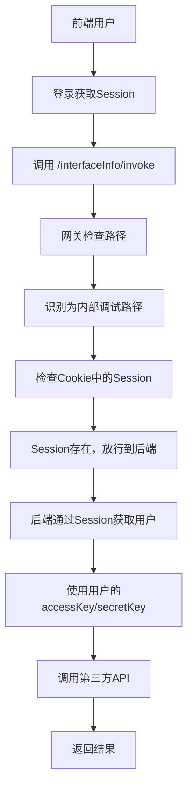
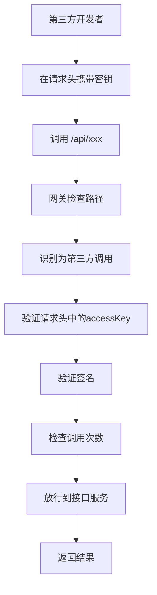

# 双重认证机制说明

## 🎯 需求概述

系统现在支持两种不同的API调用认证方式：

1. **平台内调试**：通过前端登录后调用，基于Session认证，自动使用登录用户的密钥
2. **第三方调用**：外部开发者调用，基于请求头密钥认证

## 🔧 技术实现

### 1. 网关层实现 (CustomGlobalFilter)

#### 🔐 路径分类
```java
// 白名单路径 - 完全跳过认证
private static final List<String> PATH_WHITE_LIST = Arrays.asList(
    "/user/register",    // 用户注册
    "/user/login",       // 用户登录
    "/user/login/wx_open", // 微信登录
    "/user/logout"       // 用户登出
);

// 平台内部调试路径 - 基于Session认证
private static final List<String> INTERNAL_DEBUG_PATHS = Arrays.asList(
    "/interfaceInfo/invoke"  // 接口调用
);
```

#### 🛡️ 认证流程
```java
@Override
public Mono<Void> filter(ServerWebExchange exchange, GatewayFilterChain chain) {
    String requestPath = request.getPath().value();
    
    // 1. 检查白名单路径
    if (isWhiteListPath(requestPath)) {
        return chain.filter(exchange);  // 直接放行
    }
    
    // 2. 检查平台内部调试路径
    if (isInternalDebugPath(requestPath)) {
        return handleInternalDebug(exchange, chain, request, response);
    }
    
    // 3. 第三方调用 - 执行完整的密钥认证流程
    // ... 原有的 accessKey/secretKey 认证逻辑
}
```

#### 📝 Session认证处理
```java
private Mono<Void> handleInternalDebug(ServerWebExchange exchange, GatewayFilterChain chain, 
                                       ServerHttpRequest request, ServerHttpResponse response) {
    // 获取Session信息（从Cookie中获取）
    String sessionId = getSessionFromCookie(request);
    if (sessionId == null) {
        return handleNoAuth(response);  // 无Session直接拒绝
    }
    
    // 直接放行，由后端服务处理具体的用户认证
    return chain.filter(exchange);
}
```

### 2. 后端服务实现 (InterfaceInfoController)

#### 🔑 平台内调试认证
```java
@PostMapping("/invoke")
public BaseResponse<Object> invokeInterfaceInfo(@RequestBody InterfaceInfoInvokeRequest request, 
                                               HttpServletRequest httpRequest) {
    // 获取当前登录用户（基于Session）
    User loginUser = userService.getLoginUser(httpRequest);
    
    // 自动使用登录用户的密钥
    String accessKey = loginUser.getAccessKey();
    String secretKey = loginUser.getSecretKey();
    
    // 调用API
    Object result = invokeApiByInterfaceInfo(interfaceInfo, userRequestParams, accessKey, secretKey);
    return ResultUtils.success(result);
}
```

## 🔄 调用流程对比

### 平台内调试流程


### 第三方调用流程


## 📋 请求示例

### 1. 平台内调试请求
```bash
# 前端通过Session调用
curl -X POST http://localhost:8090/interfaceInfo/invoke \
  -H "Content-Type: application/json" \
  -H "Cookie: SESSION=your-session-id" \
  -d '{
    "id": 1,
    "userRequestParams": "{\"name\":\"测试\"}"
  }'
```

**特点**：
- ✅ 不需要在请求头携带密钥
- ✅ 基于Cookie的Session认证
- ✅ 自动使用登录用户的密钥
- ✅ 用户体验友好

### 2. 第三方调用请求
```bash
# 第三方开发者调用
curl -X GET http://localhost:8090/api/name \
  -H "accessKey: qiapi_1703123456789_abc12def" \
  -H "secretKey: your-secret-key" \
  -H "nonce: 12345" \
  -H "timestamp: 1703123456" \
  -H "sign: calculated-signature" \
  -H "body: {}"
```

**特点**：
- ✅ 需要完整的签名认证
- ✅ 支持调用次数统计
- ✅ 支持多租户隔离
- ✅ 安全性更高

## 🛠️ 配置说明

### 网关路由配置
```yaml
spring:
  cloud:
    gateway:
      routes:
        - id: user_route
          uri: http://localhost:7529
          predicates:
            - Path=/user/**
        - id: interface_route  
          uri: http://localhost:7529
          predicates:
            - Path=/interfaceInfo/**
        - id: api_route
          uri: http://localhost:8101
          predicates:
            - Path=/api/**
```

### 认证路径配置
- **白名单路径**：`/user/register`, `/user/login`, `/user/logout` 等
- **内部调试路径**：`/interfaceInfo/invoke`
- **第三方API路径**：`/api/**`

## 🔍 调试和监控

### 日志输出
```
# 平台内调试
INFO: 平台内部调试路径，使用Session认证：/interfaceInfo/invoke
INFO: 平台内部调试请求，直接放行由后端服务处理

# 第三方调用
INFO: 请求路径：http://localhost:8101/api/name
INFO: 开始执行用户鉴权流程
INFO: 签名验证通过，用户：xxx
```

### 前端集成建议
```javascript
// 平台内调试 - 自动携带Session
const invokeApi = async (apiId, params) => {
  const response = await fetch('/interfaceInfo/invoke', {
    method: 'POST',
    credentials: 'include',  // 自动携带Cookie
    headers: {
      'Content-Type': 'application/json'
    },
    body: JSON.stringify({
      id: apiId,
      userRequestParams: JSON.stringify(params)
    })
  });
  return response.json();
};
```

## ✅ 实现优势

1. **用户体验优化**
   - 平台内调试无需手动输入密钥
   - 自动使用当前用户的凭证
   - 简化调试流程

2. **安全性保障**
   - Session和密钥双重认证机制
   - 第三方调用仍保持严格验证
   - 调用来源可追溯

3. **功能完整性**
   - 支持平台内外两种调用方式
   - 保持原有的统计和监控功能
   - 向后兼容现有的第三方集成

4. **架构清晰**
   - 网关层统一处理认证逻辑
   - 后端服务专注业务实现
   - 职责分离，便于维护

现在你的系统完美支持了两种认证方式，用户在平台内调试时体验更加友好！