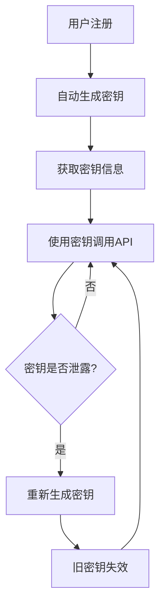

# 用户密钥管理接口文档

## 概述
为了提供完整的 API 开放平台功能，系统现在支持用户自主生成和管理 API 密钥对（AccessKey 和 SecretKey）。

## 功能特性

### 🔐 密钥安全特性
- **自动生成**: 用户注册时自动生成 API 密钥对
- **安全随机**: 使用 SecureRandom 生成高强度密钥
- **格式规范**: AccessKey 采用 `qiapi_` 前缀便于识别
- **掩码显示**: 查询时 SecretKey 采用掩码显示保护安全

### 📋 接口列表

#### 1. 生成 API 密钥
**接口路径**: `POST /user/generate/keys`
**功能**: 为用户生成新的 API 密钥对（首次生成）
**权限**: 需要登录

**请求示例**:
```bash
curl -X POST http://localhost:8090/user/generate/keys \
  -H "Content-Type: application/json" \
  -H "Cookie: your-session-cookie"
```

**响应示例**:
```json
{
  "code": 0,
  "data": {
    "accessKey": "qiapi_1703123456789_abc12def",
    "secretKey": "A1b2C3d4E5f6G7h8I9j0K1l2M3n4O5p6Q7r8S9t0U1v2W3x4Y5z6A7b8C9d0E1f2",
    "hasKeys": true,
    "generateTime": "2023-12-21 10:30:00",
    "usage": "请妥善保管您的密钥信息，不要泄露给他人。AccessKey用于身份识别，SecretKey用于签名验证。"
  },
  "message": "ok"
}
```

#### 2. 重新生成 API 密钥
**接口路径**: `POST /user/regenerate/keys`
**功能**: 重新生成 API 密钥对（会使旧密钥失效）
**权限**: 需要登录

**请求示例**:
```bash
curl -X POST http://localhost:8090/user/regenerate/keys \
  -H "Content-Type: application/json" \
  -H "Cookie: your-session-cookie"
```

**响应示例**:
```json
{
  "code": 0,
  "data": {
    "accessKey": "qiapi_1703123456890_xyz98abc",
    "secretKey": "Z9y8X7w6V5u4T3s2R1q0P9o8N7m6L5k4J3i2H1g0F9e8D7c6B5a4Z3y2X1w0V9u8",
    "hasKeys": true,
    "generateTime": "2023-12-21 10:35:00",
    "usage": "请妥善保管您的密钥信息，不要泄露给他人。AccessKey用于身份识别，SecretKey用于签名验证。"
  },
  "message": "ok"
}
```

#### 3. 查看当前密钥信息
**接口路径**: `GET /user/get/keys`
**功能**: 查看当前用户的密钥信息（SecretKey 掩码显示）
**权限**: 需要登录

**请求示例**:
```bash
curl -X GET http://localhost:8090/user/get/keys \
  -H "Cookie: your-session-cookie"
```

**响应示例**:
```json
{
  "code": 0,
  "data": {
    "accessKey": "qiapi_1703123456789_abc12def",
    "secretKey": "A1b2************************************************E1f2",
    "hasKeys": true,
    "generateTime": "2023-12-21 10:30:00",
    "usage": "请妥善保管您的密钥信息，不要泄露给他人。AccessKey用于身份识别，SecretKey用于签名验证。"
  },
  "message": "ok"
}
```

### 📝 密钥格式说明

#### AccessKey 格式
- **前缀**: `qiapi_`
- **时间戳**: 13 位时间戳
- **随机字符**: 8 位随机字符串
- **完整格式**: `qiapi_{timestamp}_{randomString}`
- **示例**: `qiapi_1703123456789_abc12def`

#### SecretKey 格式
- **长度**: 64 位字符
- **字符集**: 大小写字母 + 数字 (A-Z, a-z, 0-9)
- **生成方式**: SecureRandom 安全随机数
- **示例**: `A1b2C3d4E5f6G7h8I9j0K1l2M3n4O5p6Q7r8S9t0U1v2W3x4Y5z6A7b8C9d0E1f2`

### 🔒 安全机制

#### 1. 自动生成
- 用户注册时自动生成密钥对
- 无需手动干预，确保所有用户都有密钥

#### 2. 安全存储
- SecretKey 在数据库中明文存储（用于签名验证）
- 查询接口返回时进行掩码处理

#### 3. 密钥更新
- 支持重新生成密钥
- 旧密钥立即失效
- 操作日志记录

#### 4. 权限控制
- 只能管理自己的密钥
- 需要登录认证
- 防止越权操作

### 📊 使用流程



### 🛡️ 最佳实践

1. **密钥保护**
   - 不要在前端代码中硬编码密钥
   - 不要在 URL 参数中传递 SecretKey
   - 定期更换密钥

2. **签名验证**
   - 使用 SecretKey 对请求进行签名
   - 在请求头中传递签名信息
   - 验证时间戳防止重放攻击

3. **密钥管理**
   - 记录密钥生成和更新时间
   - 监控密钥使用情况
   - 及时更换疑似泄露的密钥

### 📋 相关接口

- **用户注册**: `POST /user/register` - 自动生成密钥
- **用户登录**: `POST /user/login` - 获取 Session
- **接口调用**: `POST /interfaceInfo/invoke` - 使用密钥认证

### ⚠️ 注意事项

1. **密钥唯一性**: 每个用户的 AccessKey 全局唯一
2. **密钥有效期**: 密钥永久有效，除非主动重新生成
3. **并发安全**: 密钥生成操作支持并发
4. **日志记录**: 密钥操作会记录在系统日志中
5. **数据备份**: 建议定期备份用户密钥信息

现在用户可以自主管理自己的 API 密钥，无需管理员手动配置！
