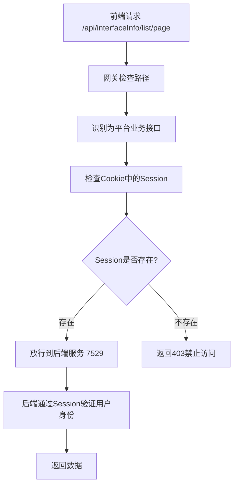
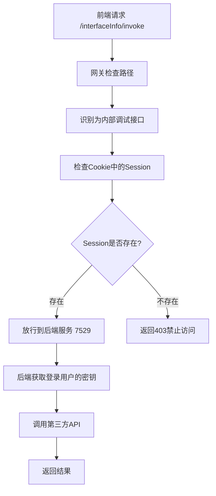
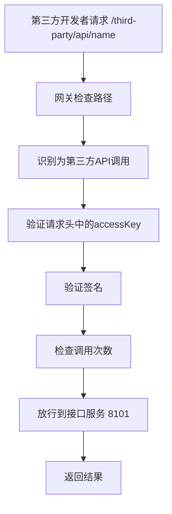

# 重新设计的路径规划说明

## 🎯 问题背景

你提到的问题很重要：前端的 `/api` 路径并不都是第三方API调用，很多是平台自身的业务接口。

例如：`http://localhost:8000/api/interfaceInfo/list/page?current=1&pageSize=5` 这是平台的分页查询接口，不应该走第三方API的认证流程。

## 🔧 重新设计的路径规划

### 1. 路径分类

#### 🟢 白名单路径（完全跳过认证）
```
/user/register      - 用户注册
/user/login         - 用户登录  
/user/login/wx_open - 微信登录
/user/logout        - 用户登出
```

#### 🔵 平台业务接口（需要登录，基于Session认证）
```
/api/user/**           - 平台用户管理接口
/api/interfaceInfo/**  - 平台接口信息管理接口
/api/analysis/**       - 平台数据分析接口
```

#### 🟡 平台内部调试接口（需要登录，基于Session认证）  
```
/interfaceInfo/invoke  - 接口调用调试
```

#### 🔴 第三方API调用（需要密钥签名认证）
```
/third-party/**        - 第三方API调用路径
```

#### 🟣 其他路径（直接放行）
```
/user/**              - 用户相关直接接口
/interfaceInfo/**     - 接口信息直接接口（除invoke外）
/analysis/**          - 分析相关直接接口
```

### 2. 网关路由配置

```yaml
spring:
  cloud:
    gateway:
      routes:
        # 平台业务接口路由 - 需要登录认证
        - id: platform_api_route
          uri: http://localhost:7529
          predicates:
            - Path=/api/**
            
        # 用户相关接口
        - id: user_route
          uri: http://localhost:7529
          predicates:
            - Path=/user/**
            
        # 接口信息管理 - 包括invoke调试
        - id: interface_route
          uri: http://localhost:7529
          predicates:
            - Path=/interfaceInfo/**
            
        # 数据分析接口
        - id: analysis_route
          uri: http://localhost:7529
          predicates:
            - Path=/analysis/**
            
        # 第三方API调用路由 - 需要密钥认证
        - id: third_party_api_route
          uri: http://localhost:8101
          predicates:
            - Path=/third-party/**
```

### 3. 认证流程

#### 🔵 平台业务接口认证流程


#### 🟡 平台内部调试认证流程


#### 🔴 第三方API调用认证流程


## 📋 请求示例对比

### 1. 平台业务接口请求
```bash
# 前端分页查询接口
curl -X GET "http://localhost:8090/api/interfaceInfo/list/page?current=1&pageSize=5" \
  -H "Cookie: SESSION=your-session-id"
```

**特点**：
- ✅ 只需要Session认证
- ✅ 用于平台业务功能
- ✅ 前端用户日常操作

### 2. 平台内部调试请求
```bash
# 前端调试接口
curl -X POST http://localhost:8090/interfaceInfo/invoke \
  -H "Content-Type: application/json" \
  -H "Cookie: SESSION=your-session-id" \
  -d '{"id":1,"userRequestParams":"{\"name\":\"test\"}"}'
```

**特点**：
- ✅ Session认证，自动使用用户密钥
- ✅ 用于接口调试
- ✅ 用户体验友好

### 3. 第三方API调用请求
```bash
# 第三方开发者调用（新路径）
curl -X GET http://localhost:8090/third-party/api/name \
  -H "accessKey: qiapi_1703123456789_abc12def" \
  -H "nonce: 12345" \
  -H "timestamp: 1703123456" \
  -H "sign: calculated-signature" \
  -H "body: {}"
```

**特点**：
- ✅ 完整的密钥认证
- ✅ 用于第三方集成
- ✅ 安全性最高

## 🔄 迁移方案

### 对于现有的第三方开发者
需要将API调用路径从 `/api/**` 改为 `/third-party/**`

#### 迁移示例
```bash
# 旧的调用方式
curl -X GET http://localhost:8090/api/name

# 新的调用方式  
curl -X GET http://localhost:8090/third-party/api/name
```

### 对于前端开发
前端的平台业务接口路径保持不变，继续使用 `/api/**`

#### 前端接口分类
```javascript
// 平台业务接口 - Session认证
const platformApi = {
  getUserList: '/api/user/list/page',
  getInterfaceList: '/api/interfaceInfo/list/page', 
  getAnalysis: '/api/analysis/top/interface/invoke'
};

// 接口调试 - Session认证
const debugApi = {
  invokeInterface: '/interfaceInfo/invoke'
};

// 第三方API调用 - 密钥认证（如果前端需要直接调用）
const thirdPartyApi = {
  callExternalApi: '/third-party/api/name'  
};
```

## ✅ 实现优势

1. **路径语义清晰**
   - `/api/**` = 平台业务接口
   - `/interfaceInfo/invoke` = 平台调试接口  
   - `/third-party/**` = 第三方API调用

2. **认证机制合理**
   - 平台接口使用Session，用户体验好
   - 第三方调用使用密钥，安全性高
   - 白名单接口无需认证，注册登录顺畅

3. **向后兼容**
   - 前端代码基本不需要修改
   - 只需要第三方开发者更新调用路径

4. **架构清晰**
   - 业务逻辑分离明确
   - 认证流程职责单一
   - 便于后续扩展

现在你的系统路径规划更加合理，平台业务接口和第三方API调用完全分离了！🎉